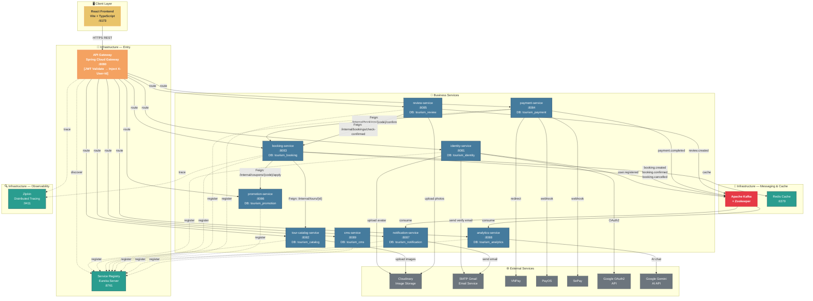
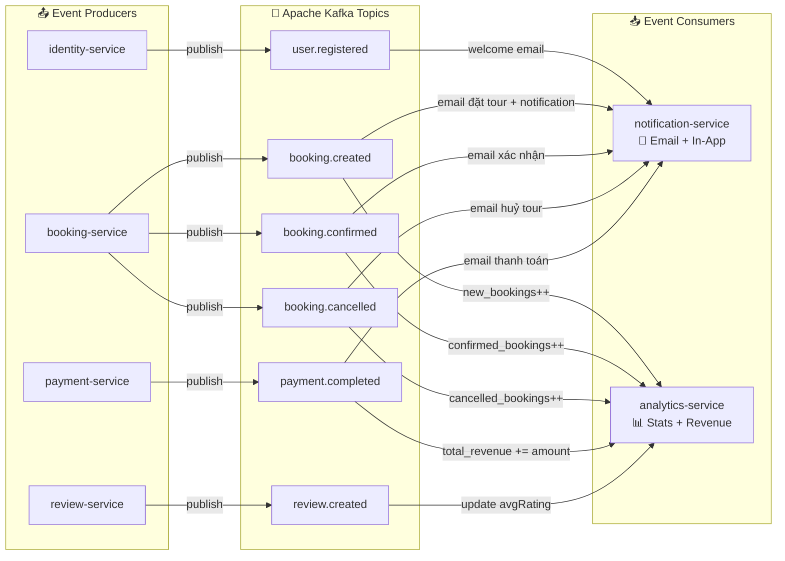
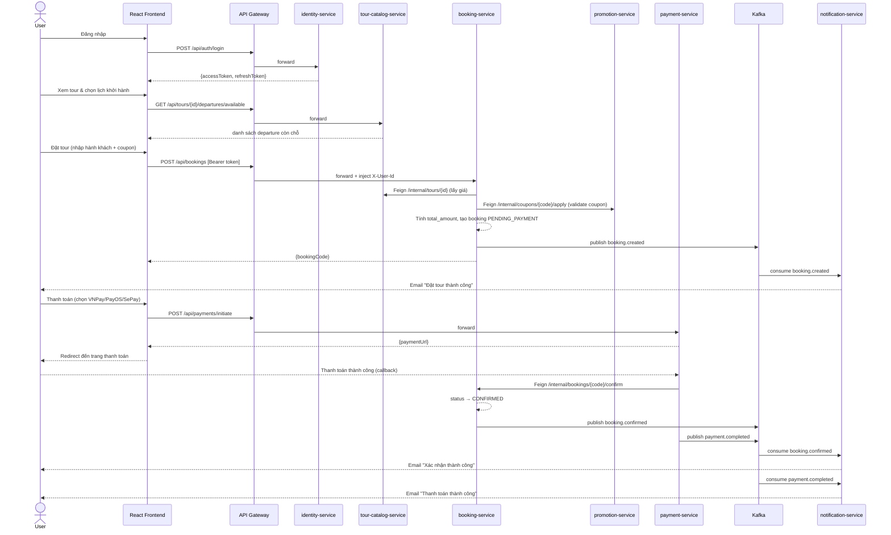
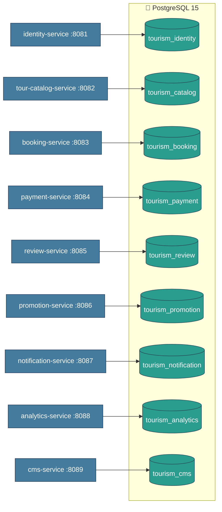

# 🗺️ Tourism Microservices — Architecture Diagram

## 1. Tổng Quan Kiến Trúc (Overview)

---

## 2. Luồng Kafka Events (Event-Driven Flow)

---

## 3. Luồng Đặt Tour (Core Business Flow)

---

## 4. Sơ Đồ Database Per Service

---

## 5. Bảng Tổng Hợp Services

| Service | Port | Database | Feign Calls | Kafka Publish | Kafka Consume | External |
|---------|------|----------|-------------|---------------|---------------|----------|
| **api-gateway** | 8080 | — | — | — | — | — |
| **service-registry** | 8761 | — | — | — | — | — |
| **identity-service** | 8081 | tourism_identity | — | `user.registered` | — | Google OAuth, Cloudinary, SMTP |
| **tour-catalog-service** | 8082 | tourism_catalog | — | — | — | Cloudinary |
| **booking-service** | 8083 | tourism_booking | tour-catalog, promotion | `booking.created/confirmed/cancelled` | — | Redis |
| **payment-service** | 8084 | tourism_payment | booking | `payment.completed` | — | VNPay, PayOS, SePay |
| **review-service** | 8085 | tourism_review | booking | `review.created` | — | Cloudinary |
| **promotion-service** | 8086 | tourism_promotion | — | — | — | — |
| **notification-service** | 8087 | tourism_notification | — | — | `booking.*`, `payment.completed`, `user.registered` | SMTP |
| **analytics-service** | 8088 | tourism_analytics | — | — | `booking.*`, `payment.completed`, `review.created` | Google Gemini AI |
| **cms-service** | 8089 | tourism_cms | — | — | — | — |
